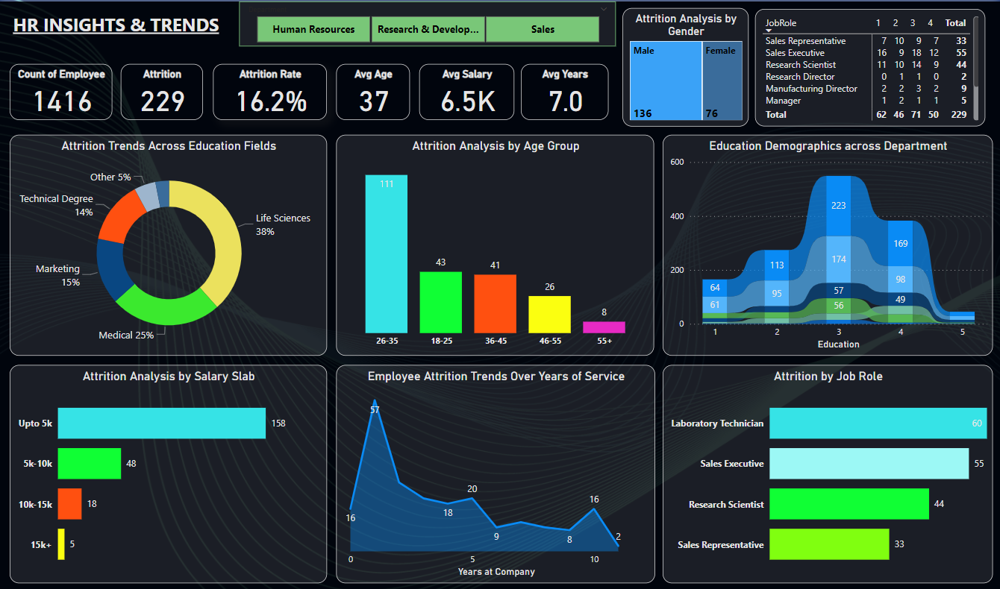
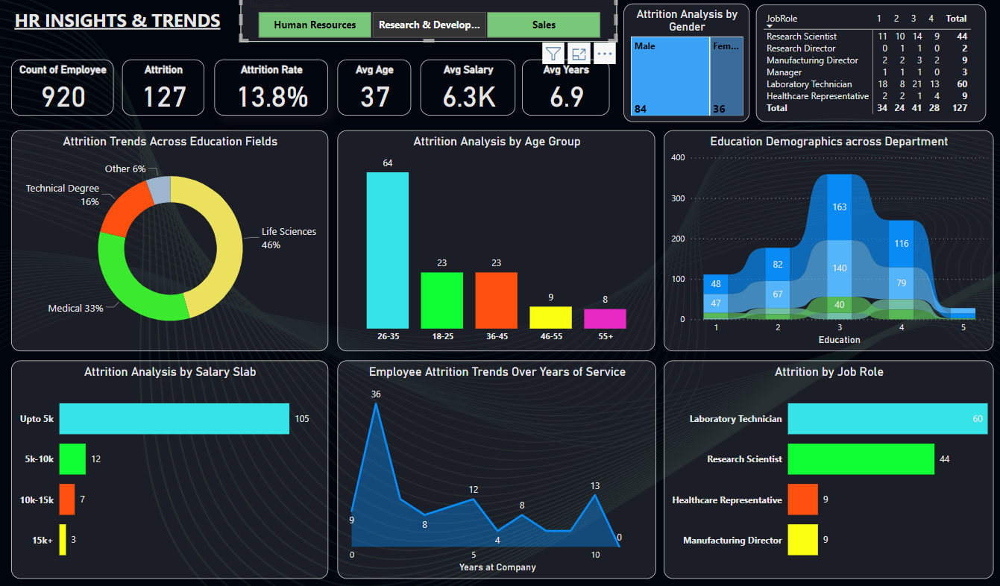

# HR Analytics Power BI
---

<table>
    <tr>
        <td></td>
        <td></td>
    </tr>
    <tr>
        <td></td>
        <td></td>
    </tr>
</table>

---

## Overview

Transform your HR strategy with our advanced Power BI dashboard, meticulously crafted for HR analytics. Gain profound insights into workforce dynamics, employee performance, and key HR metrics. Elevate decision-making and strategic planning through tailored visualizations, empowering human resources professionals with the tools they need for informed and impactful organizational management.

---

## KPIs Overview

| KPI                        | Description                                       |
|-----------------------------|---------------------------------------------------|
| Count of Employees          | Total number of employees in the organization.    |
| Attrition and Attrition Rate| Measure of employee turnover and its percentage.  |
| Average Age, Salary, and Years of Service | Average values for age, salary, and years of service. |

## Key Features

| Feature                                   | Description                                               |
|-------------------------------------------|-----------------------------------------------------------|
| **Dynamic Slices**                        | Granular workforce metrics across departments   (Human Resources, Research and Development, Sales). |
| **Interactive Charts**                    |  • Attrition Analysis   • Gender Distribution           |
| **Education Field Analysis**              | Explore attrition trends based on educational backgrounds. |
| **Age Group Analysis**                    | Uncover insights into age-related attrition patterns.     |
| **Salary Slab Analysis**                  | Correlate salary levels with employee turnover.           |
| **Data-Backed Recommendations**           | Empower HR decision-makers with actionable insights.      |

---

---

## Collaboration and Feedback

If you have suggestions, improvements, or would like to contribute, please create an [issue](https://github.com/hitchhicker007/hr_analytics_powerbi.git/issues) or [pull request](https://github.com/hitchhicker007/hr_analytics_powerbi.git/pulls). Your input is valuable in enhancing the effectiveness of HR analytics.

--- 

## LinkedIn

